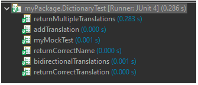
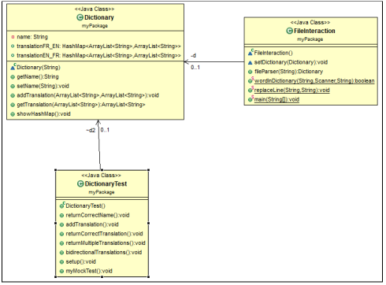
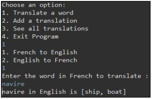
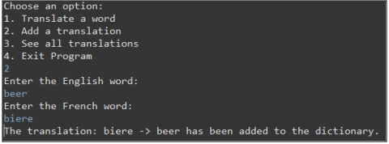
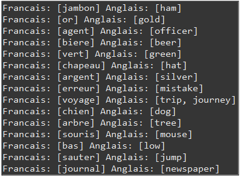

<h1 align="center"> Dictionary-with-JUnit-Testing </h1>
 

  
  

>## Project:
For this project we had to implement an English ↔️ French dictionary whilst also testing all our methods with JUnit.

🕙 Completed in the third year of my Computer Science degree at the F.S.T Limoges (France) with Yoann SOCHAJ.

📚 Class: Génie Logiciel

>## Features:
- Translate a word 

  

- Add a translation 

  

- See all translations 

  

>## Technology used:
- Java
- Eclipse

>## Authors:
- Matt TAYLOR
- Yoann SOCHAJ [(GitHub profile)](https://github.com/YoannSo)

>## Useful Links:
Project report: [TAYLOR_SOCHAJ_Rapport_Projet.pdf](TAYLOR_SOCHAJ_Rapport_Projet.pdf)
